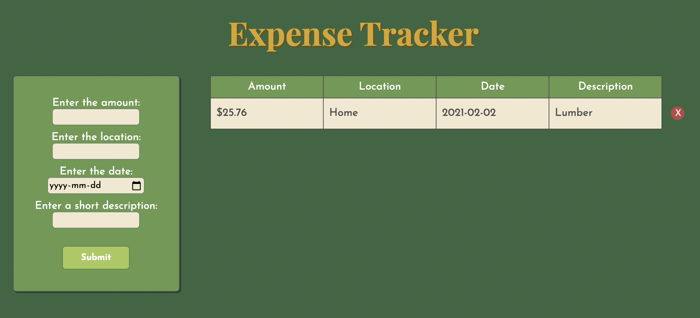

# Expense Tracker App

### An expense tracker created with HTML, CSS, Javascript, and Flex-Box.

### See it [here](https://bryangk.github.io/expense_tracker/)

## Summary

A simple app to keep track of expenses. Part of the base apps for Software Developer Mastermind. I'm getting the hang of using Javascript to create elements and manipulate the DOM. Some basic flex-box usage, definitely need more practice.

## Author

Bryan Krauss - Full Stack Software Developer - [LinkedIn](https://www.linkedin.com/in/bryan-krauss-556b3a200/)